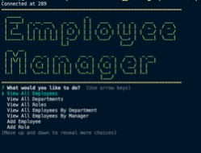

# EmployeeTracker

## Description

This is a basic CMS for managing a company's employees from a CLI that the user can interact with using Node.js, inquirer and MySQL.

## Table of Contents

\*[Installation](#installation)

\*[Usage](#usage)

\*[License](#license)

\*[Contributing](#contributing)

\*[Tests](#tests)

\*[Questions](#questions)

## Installation

To install necessary dependencies, run the following command:

1. npm install, 2. npm install mysql inquirer console.table 3. node server.js, 4. Database schema and seed data located in assets directory 5. Follow the prompts to manage the employees or modify the database content

## Usage

_Instructions and examples of how to use:_

> node server.js

This application can be used by anyone in the company to manage employee information on Title, salary, department, first and last name.

## License

The Unlicense
This is free and unencumbered software released into the public domain. Anyone is free to copy, modify, publish, use, compile, sell, or distribute this software, either in source code form or as a compiled binary, for any purpose, commercial or non-commercial, and by any means.

## Contributing

## Tests

none

## Questions

For any questions: mailto:jericfey@gmail.com

GitHub profile: https://github.com/jericfey
